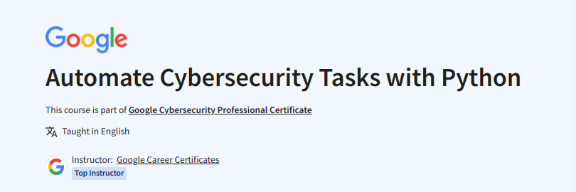

## Automate Cybersecurity Tasks with Python

This is the seventh course of the Professional Cybersecurity Course offered by Google Inc. on [Coursera](https://www.coursera.org/learn/automate-cybersecurity-tasks-with-python). Feel free to explore.

Since I had some basic understanding of programming with Python, I focused more on the security and automation examples.
>The labs for this course are available when you enroll for the course.

My learning experience are summarized as follows:
>PEP 8 [Python Enhancement Proposal](https://peps.python.org/pep-0008/)

>Basics: [strings, conditionals, functions](basics.py)

>Regular Expressions: [REGEX](https://docs.python.org/3/library/re.html) :
A regular expression (regex) is a sequence of characters that forms a pattern. You can use these in Python to search for a variety of patterns. This could include IP addresses, emails, or device IDs.

>Analysing log files: [Using the 're' modules to search for error patterns, ](log_analysis.py)